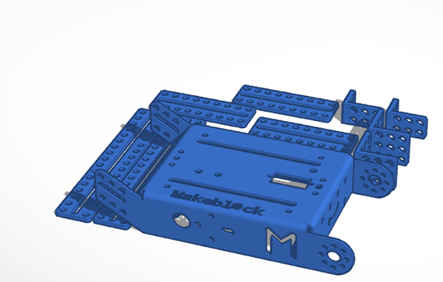
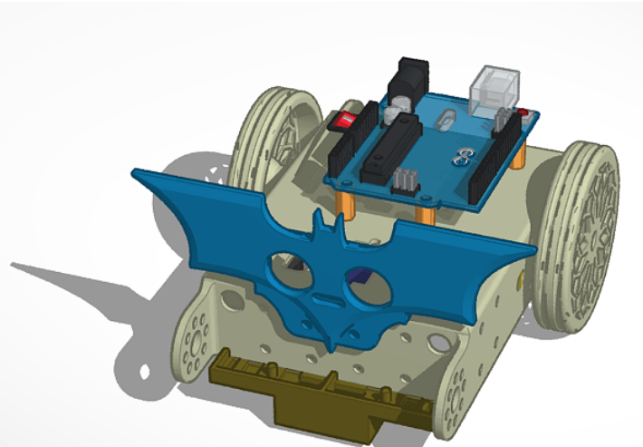
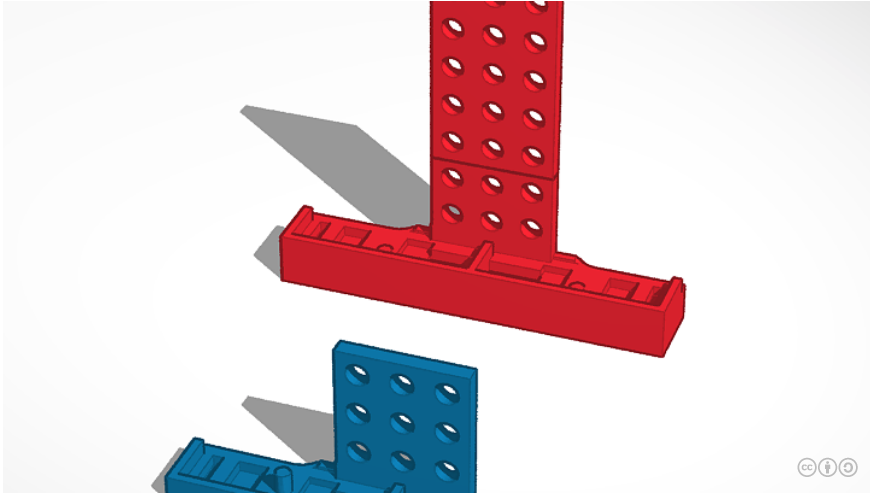
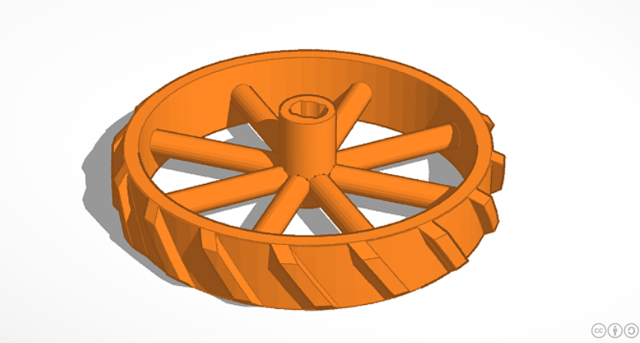
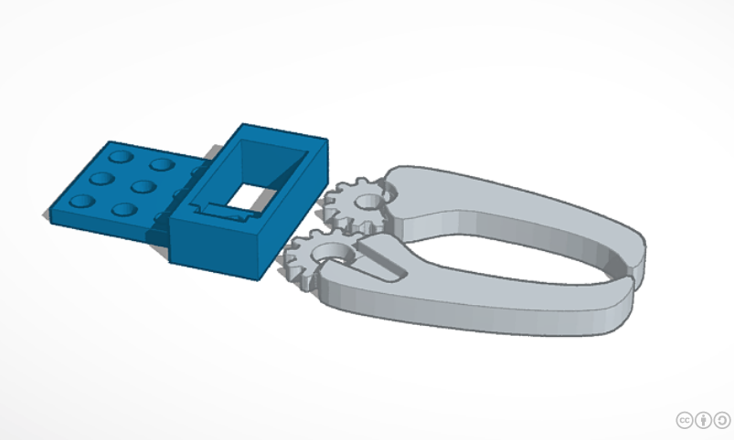

## Modelos 3D

[Modelo mbot y piezas/complementos](https://www.tinkercad.com/things/6fWqzB8TNPY-pezzi-mbot)

[mClon](https://www.tinkercad.com/things/doIDQtggrYq-mclon)

[Soporte sensores siguelineas makeblock](https://www.tinkercad.com/things/6PsHgiIDqYq-ir-sensor-for-makeblock-ranger-v02)

[Rueda para robot makeblock](https://www.tinkercad.com/things/4yNFUFEvpx8-makeblock-motor-wheel-support-needed)

[Pinza accionada por servo para robot makeblock](https://www.tinkercad.com/things/1bbqR13OB4j-micro-servo-claw-for-mbot)

[Diseños en tinkercad](https://www.tinkercad.com/search?q=makeblock)

[Diseños en thingiverse](https://www.thingiverse.com/search?q=makeblock&dwh=665d4006cc95025)
