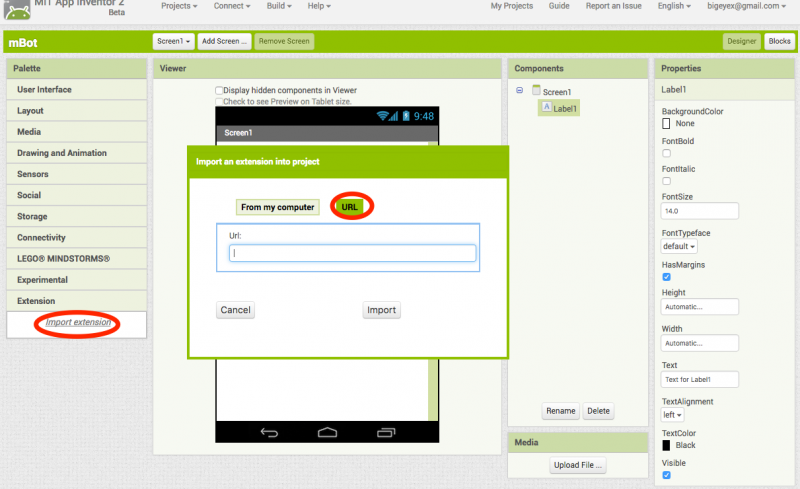
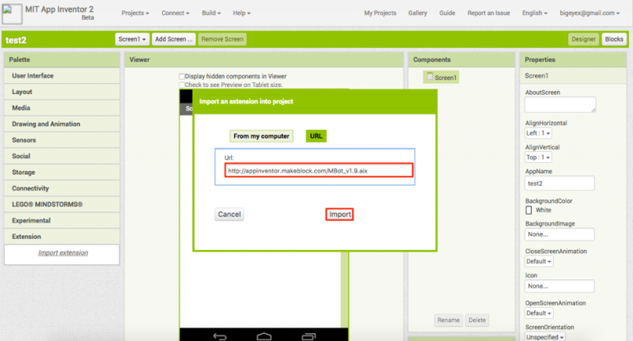
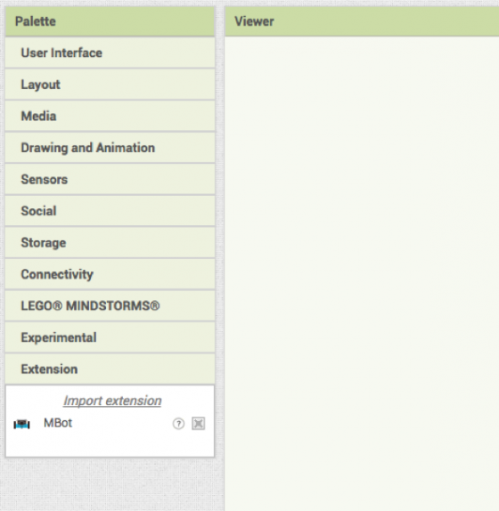
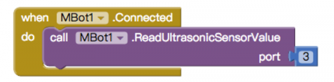

## MakeBlock & AppInventor

Añadimos la extensión mBot

### http://appinventor.makeblock.com/MBot_v1.9.aix

### Obtenemos un nuevo componente

### Tendremos bloques para manejarlo

### Recursos

[Documentación](https://www.makeblock.com/project/use-mbot-with-app-inventor-v-1-9)

[Más detalles](http://appinventor.makeblock.com/mbot_app_inventor_1.9_guide.docx)
