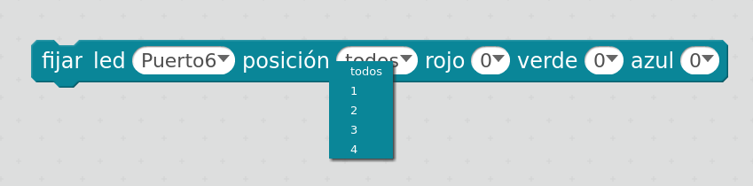
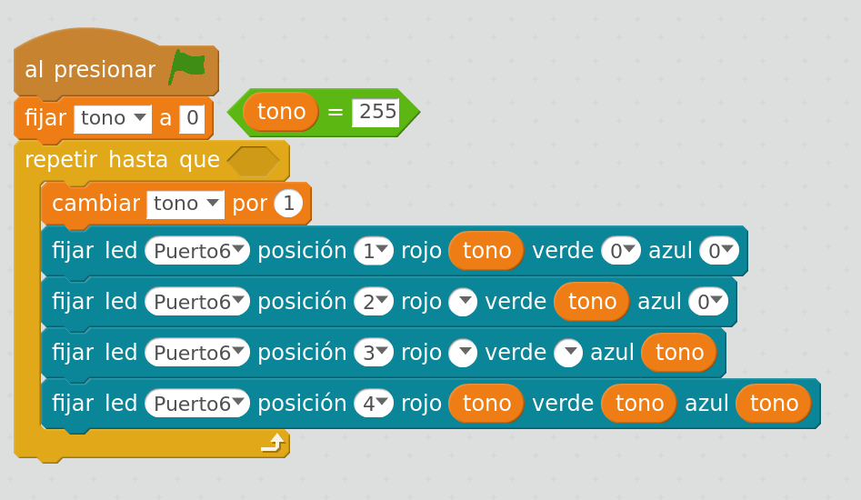

## Módulo con 4 Leds RGB

Se trata de un módulo que nos permite controlar 4 leds RGB, es decir que cada uno de ellos puede mostrar un color determinado  

Para establecer el color usaremos la notación RGB, que consiste en 3 números entre 0 (apagado) y 255 (máximo brillo) que determinan la intensidad de cada una de las componentes Red (rojo), Green (verde) y Blue (azul). Si las tres componentes son iguales se consigue un gris (o blanco con distinta luminosidad)

Lo controlaremos con el siguiente bloque

Donde seleccionaremos el conector, a qué led nos refierimos (o a todos) y las 3 componentes del color.

[Selector de color](https://www.w3schools.com/colors/colors_picker.asp)

### Ejemplo: vamos a hacer un ciclo de color para ver como van cambiando

Cada uno de los 3 primeros leds mostrarán gradaciones de cada color primario y el 4º niveles de grises

[4LedsRGB.sb2](../Ejemplos/4LedsRGB.sb2)

[Ejemplo: RuletaLed.sb2](../Ejemplos/RuletaLed.sb2)

