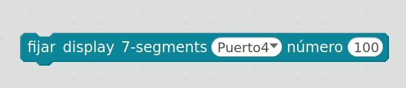
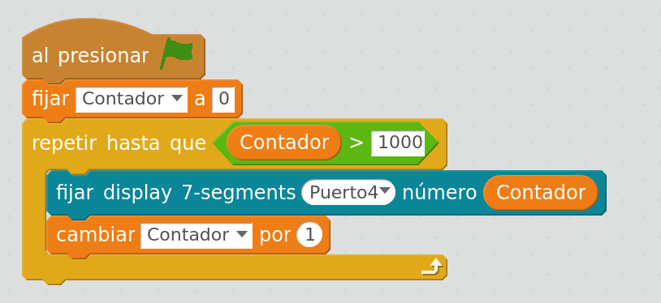

## Módulo de 4 dígitos de 7 segmentos

Se trata de un módulo que permite mostrar hasta 4 dígitos usando para ello 7 segmentos (que no son otra cosa que leds)

Su uso es muy sencillo basta con usar el bloque que nos permite mostrar un número y seleccionando el puerto al que lo hemos conectado

### Ejemplo: mostrar una sucesión de números en el display

Usaremos una variable que servirá como contador y cuyo valor iremos incrementando en cada iteración

[Ejemplo contador 7 segmentos](../Ejemplos/ContadorEn7Segmentos.sb2)

#### Mejoras
* Añadir un retardo para facilitar ver los valores

Podemos usar este módulo para visualizar medidas de sensores o cualquier dato que interese al usuario.

También lo podemos usar para depurar nuestros programas, mostrando valores de variables

