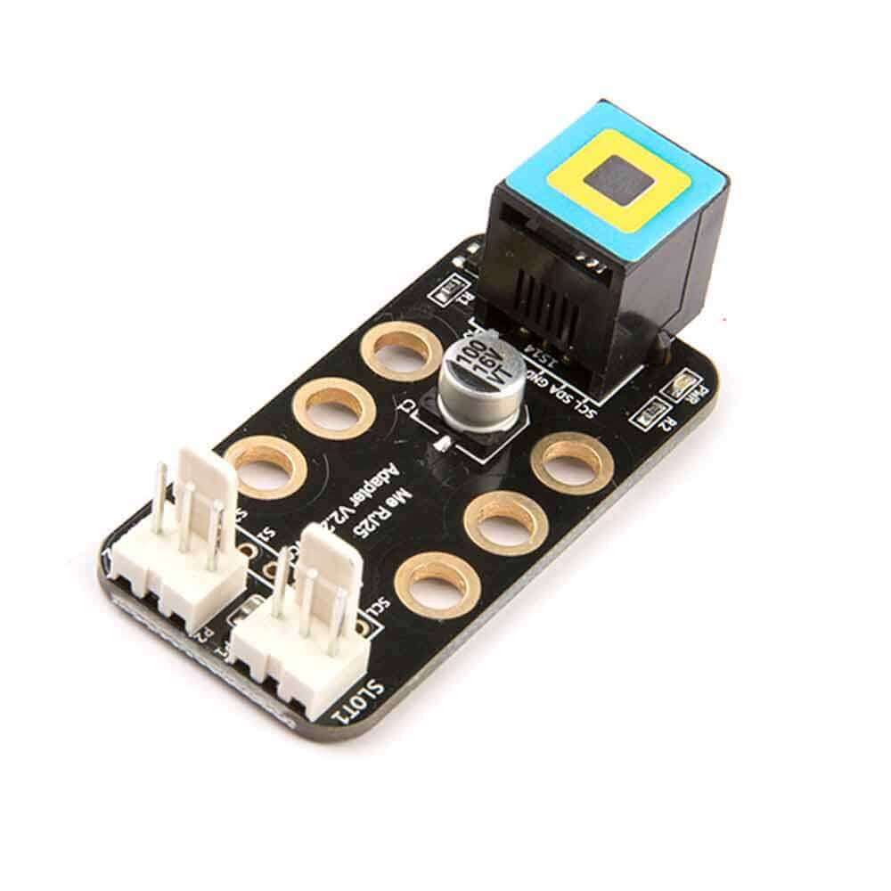
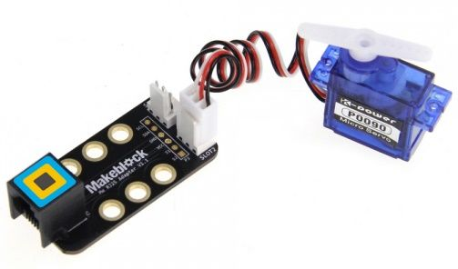
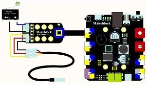
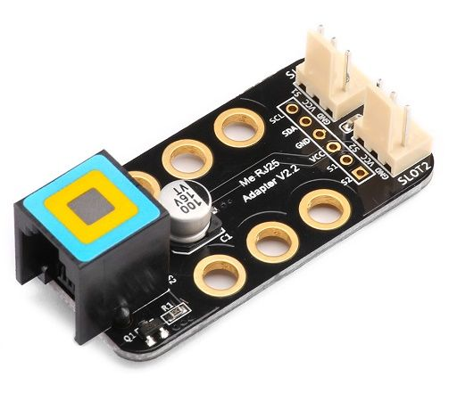

# Adaptador MakeBlock-Arduino

Este módulo nos permite conectar a la CPU de MakeBlock componentes estándar usualmente usados con Arduino. Teneos por un lado el conector RJ25.

Cada uno de estos 

¡¡CUIDADO CON LA POLARIDAD!! ¡¡Podemos estropear el módulo!!

[Documentacón oficial del adaptador](https://www.makeblock.com/project/me-rj25-adapter)

## Conexión usando placa de prototipo

Una placa de prototipo tiene este conexionado interior 

(Si usáramos una placa de las de mayor tamaño las conexiones serían así)

