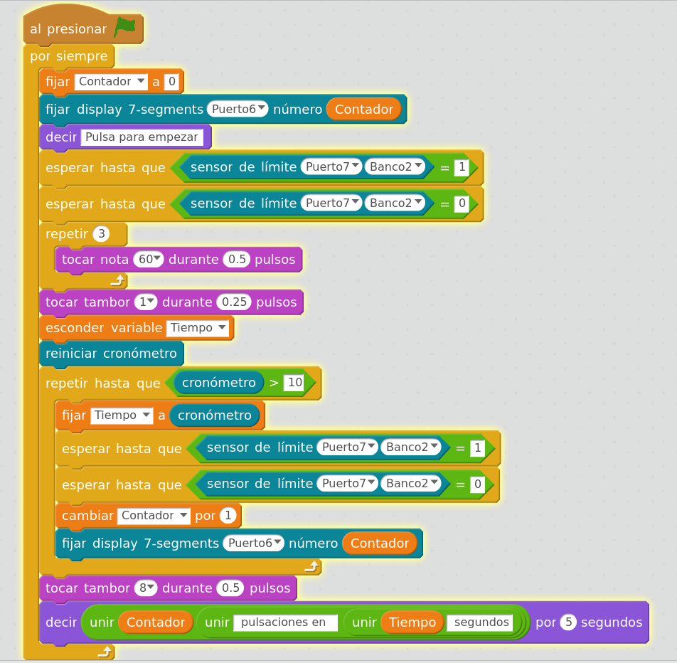

## Contador de Pulsaciones

Vamos a contar cuantas pulsaciones realizamos en un [microinterruptor](../Fichas/Pulsador.md). Visualizaremos el número de pulsaciones en una pantalla de [4 dígitos y 7 segmentos](../Fichas/7Segmentos.md)

[Código](../Ejemplos/Pulsaciones_en_10_segundos.sb2)
