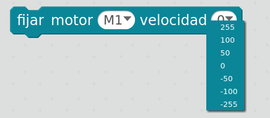

## Control Motores

Podemos controlar el movimiento de los dos motores M1 y M2 con el siguiente bloque

Valores negativos hacen girar el motor en un sentido y los positivos en el otro. En valor absoluto podemos dar valores de 0 (parado) hasta 255 (máxima velocidad). En la práctica, para valores pequeños el motor no se mueve (el valor concreto depende del nivel de carga de las baterias)

Veamos como hacer un ejemplo sencillo de movimiento en una dirección

[ControlMotores.sb2](../Ejemplos/ControlMotores.sb2)

### Mejoras

* Hacer que se mueven los dos motores en el mismo sentido
* Hacer un bucle que vaya desde la maxima velocidad en un sentido hasta la máxima en el otro

### Moviento resultante

Dependiendo de la  geometría de robot y de la velocidad de cada motor, el movimiento resultante será uno u otro

(Imagen de "juegos-robótica.es")

### Ejemplo: Realizar movimiento de giro de 180 y 360 grados
* Medir el tiempo necesario para generar esos movimientos
* Comparar los tiempos con distintos robots

### Ejemplo: Calibrar el movimiento en línea recta

Suele ocurrir  los motores no giran con igual velocidad, por ello para conseguir movimientos en línea recta es necesario ajustar las velocidas. 

* Ajustar el movimiento del robot a una línea recta de 1 metro.

### Ejemplo: Realizar un circuito donde el robot haga el siguiente movimiento:
* Avance 1metro en línea recta
* Gire 180º
* Avance 1 metro en línea recta volviendo al punto de partida
* Gire 180º para terminar en la posición original

