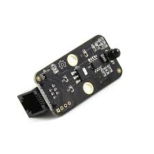

## Control remoto IR

El mando es un mando usual (podemos usar cualquier mando, solo buscando los códigos)

El receptor IR

Usaremos el mando a distancia IR para controlar el robot y que siga lineas o salga de un laberinto

## Codigos mando

[Uso de mando IR](https://makeblock.es/foro/topic/57/utilizacion-mblok-con-receptor-infrarrojos/1#post-155)

    64 Up
    25 Down
    7 Left
    9 Right
    21 Setup
    69 A
    70 B
    71 C
    68 D
    67 E
    13 F
    22 0
    12 1
    24 2
    94 3
    8 4
    28 5
    90 6
    66 7
    82 8
    74 9

