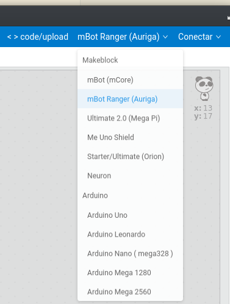

## Instalacion del Firmware

Ha de hacerse vía USB

* Conectamos el robot al PC
* Seleccionamos nuestro robot mBot Ranger(Auriga)

* Seleccionamos USB

* Pulsamos sobre "Update Firmware"

TODO: imagen de la actualizaci'on

### Posibles errores
