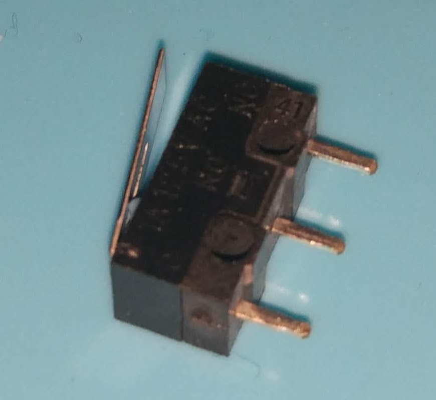
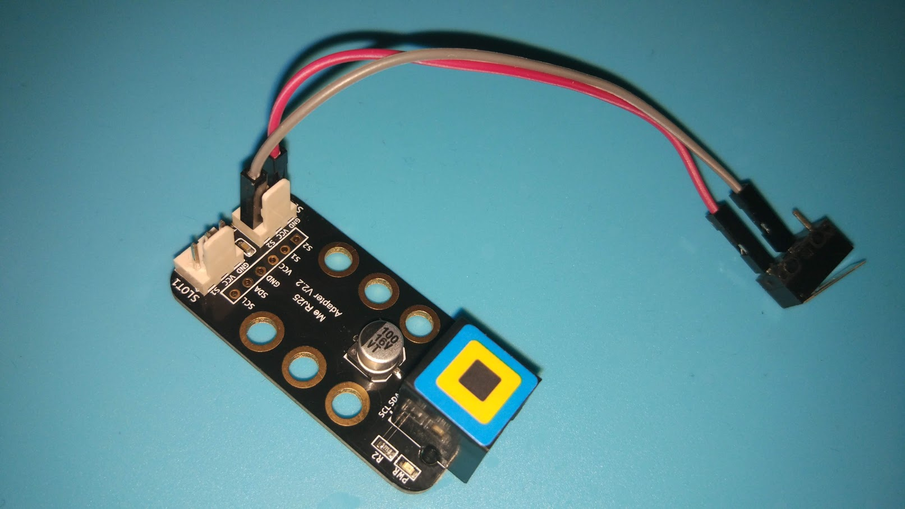

## Pulsador/microinterruptor

Vamos a aprender a usar un Pulsador/Microinterruptor

Usaremos el módulo [Adaptador Arduino](./AdaptadorArduino.md) para conectarlo

Conectaremos el pin central del microinterruptor al pin S2 del Slot2 y el pin exterior (donde más cerca está la placa metálica) al pin GND

Podremos controlar su estado con el bloque

