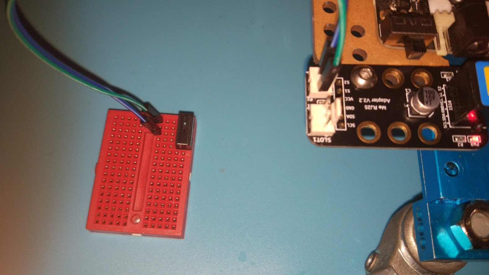
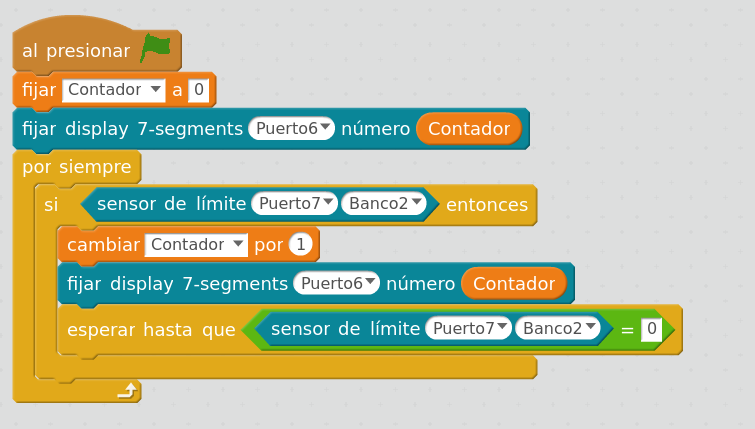

## Pulsador/microinterruptor

Vamos a aprender a usar un Pulsador/Microinterruptor

Usaremos el módulo [Adaptador Arduino](../Fichas/AdaptadorArduino.md) para conectarlo

Conectaremos el pin central del microinterruptor al pin S2 del Slot2 y el pin exterior (donde más cerca está la placa metálica) al pin GND

Podremos controlar su estado con el bloque

### Montaje del pulsador en placa de prototipo

## Ejemplo: contador de pulsaciones

Vamos a contar cuantas pulsaciones hacemos y lo mostraremos en la pantalla de 7 segmentos

Es importante notar que tenemos que detectar tanto la pulsación como cuando dejamos de pulsador (en caso de no hacerlo se incrementaría muy rápidamente)

[Contador_Pulsador_Filtrado_ranger.sb2](../Ejemplos/Contador_Pulsador_Filtrado_ranger.sb2)

### Ejemplo: [Contador pulsaciones](../Fichas/ContadorPulsaciones.md)
### Ejemplo: [midiendo Tiempos](../Fichas/TiempoEntrePulsaciones.md)
