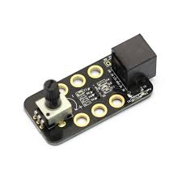

## Potenciómetro

Un potenciómetro es una resistencia variable cuyo valor podemos controlar girando su espiga. El valor estará comprendido entre 0 y 1023

Podemos medir su valor con el siguiente bloque, indicando dónde lo hemos conectado

Este sensillo programa nos permite ver su valor

[Potenciometro.sb2](../Ejemplos/Potenciometro.sb2)

### Ejemplo: Controlar la velocidad de un motor con un potenciómetro

Mediremos el valor del potenciómetro (entre 0 y 1023) y lo dividimos por 4 para obtener un valor entre 0-255 que son los valores de la velocidad

[VelocidadPotenciometro.sb2](../Ejemplos/VelocidadPotenciometro.sb2)

### Ejemplo: Controlar los niveles de las distintas componentes de un led RGB usando 3 potenciometros
