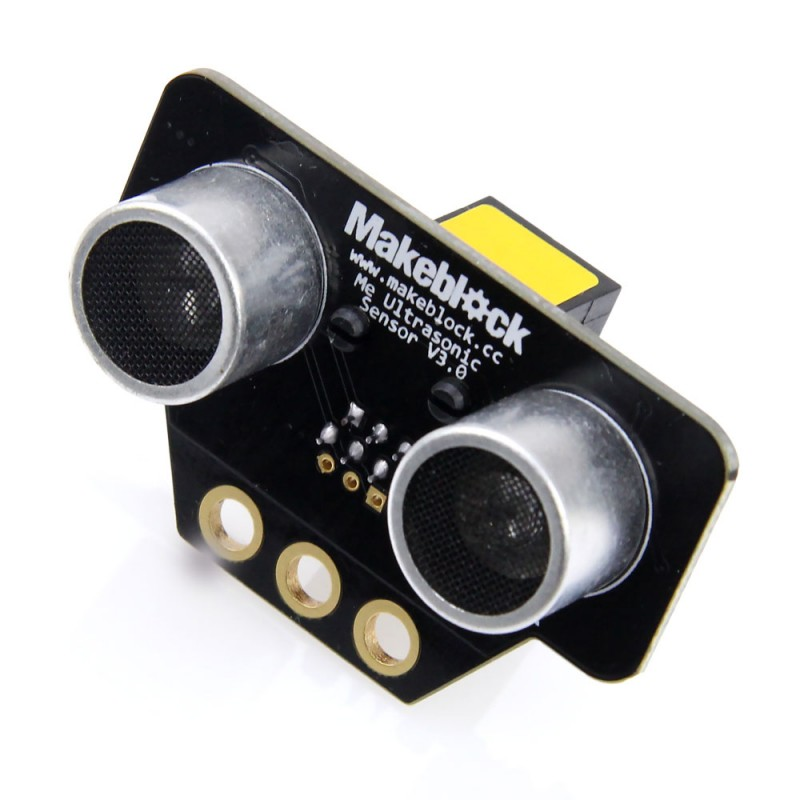
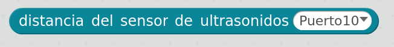
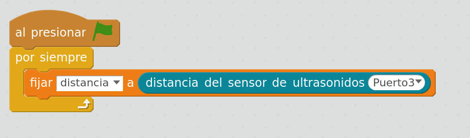

## Sensor de distancia

Se trata de un sensor de ultrasonidos que nos permite medir la distancia a los obstáculos

El funcionamiento se basa en medir el tiempo que tarda en rebotar la onda ultrasónica que se emite

Obtendremos el valor de la distancia al obstáculo usando el bloque siguiente, donde indicaremos en que puerto lo hemos conectado

Podemos hacer un sencillo programa que muestre el valor de la distancia al obstáculo. Para ello crearemos una variable __distancia__ que mostraremos en pantalla

[ProgramaMedidaDistancia.sb2](../Ejemplos/ProgramaMedidaDistancia.sb2)

### Ejemplos: estudio del comportamiento de los ultrasonidos  con diferentes tipos de objetos

* Dado que las ondas de ultrasonidos no rebotan igual en todos los objetos, se puede ver la diferencia entre usar un cartón, un metal o una tela (como una cortina)

* También se puede comprobar que la forma de los objetos influye, no es lo mismo el rebote que se produce en la cara de una caja de cartón que en una esquina de la misma

* El haz ultrasónico tiene forma cónica, es decir se va ensanchando a media que se aleja. Por eso la sensibilidad es diferente a distintas distancias. También ocurre que puede rebotar en el suelo si el sensor está muy bajo

* Comprobar como distintos robots usando ultrasonidos a la vez pueden engañarse (no distinguen si el haz que le llega es el suyo o el de otro) dando lugar a medidas erróneas

### Otros usos del sensor

Piensa otras utilidades del sensor de distancia:

* Altura de un ascensor
* Nivel de líquido en un depósito
* Sistema de alarma
* ...

### Referencias

[Funcionamiento de un sensor de ultrasonidos por Luis Llamas](https://www.luisllamas.es/medir-distancia-con-arduino-y-sensor-de-ultrasonidos-hc-sr04/)
