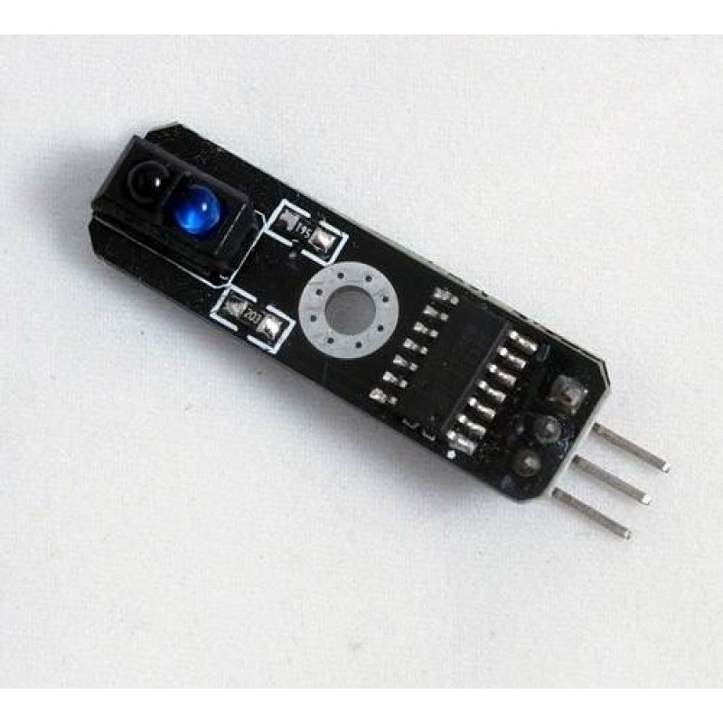
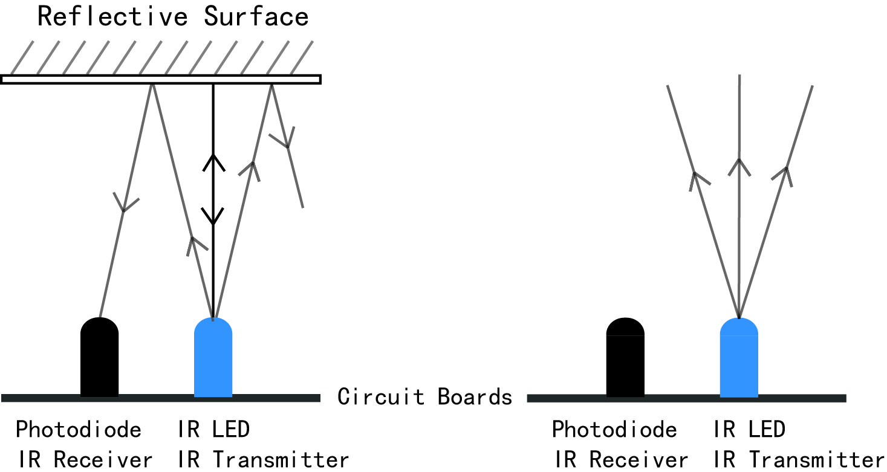

## Sensor Infrarrojo

Se trata de un sensor que es capaz de medir la cantidad de luz que se refleja en un objeto. Usa luz infrarroja que él mismo emite para evitar en la medida que se pueda la influencia de la luz ambiental

Dependiendo de la distancia, de las características y el color del objeto que refleja obtendremos un valor 0 o 1

Esto nos puede permitir detectar si la superficie sobre la que nos movemos es blanca o negra (existen otro sensores que nos proporcionan niveles de grises)

Para usar estos sensores necesitamos el [Adaptador a Arduno](../Fichas/AdaptadorArduino.md)

Conectaremos: 

    Vcc - V
    GND - GND
    Out - S
    
TODO: imagen de la conexión

Los sensores suelen tener un led verde que nos indica el estado del sensor

Podemos determinar su valor con el siguiente bloque

Veamos un sencillo programa para ver el estado del sensor

[SensorIR.sb2](../Ejemplos/SensorIR.sb2)

## Ejemplo: ver como influye el color de la superficie y la iluminación

Comprobar como diferentes superficies e iluminaciones influyen en el resultado

## Ejemplo: buscar proyectos donde puede user útil este sensores
* Contador de personas que pasan por una puerta
* Como final de carrera
* ¿Serviría con líquidos?
