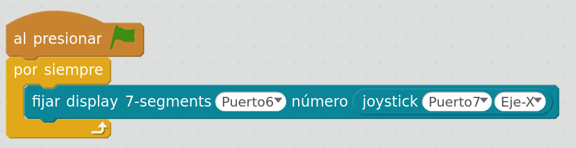

## Sensor de Luz (LDR)

Dado que no existe un bloque que lea directamente entradas analógicas, usaremos el bloque de lectura de joystick

El valor de X será el del Puerto 1 y el valor Y el del Puerto 2

Los valores pueden variar entre -490 y y 490, con lo que si le sumamos 490 tendremos valore entre 0 y 1000 (aproximadamente)

Vamos a hacer un ejemplo sencillo donde mostremos el valor leído en el display de 7 segmentos

[Código](../Ejemplos/SensorLuz_LDR.sb2)
