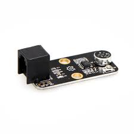

## Sensor de sonido

Se trata de un sensor que mide el volumen de sonido 

Podemos ver el valor del volumen con siguiente bloque, nos devuelve un valor entre 0 y 1023

Un programa sencillo que lo usa

[SensorSonido.sb2](../Ejemplos/SensorSonido.sb2)

Ejemplos/Detector de sonido.sb2

### También podemos usar el micrófono del PC

Ejemplos/ControlVolumen.sb2
