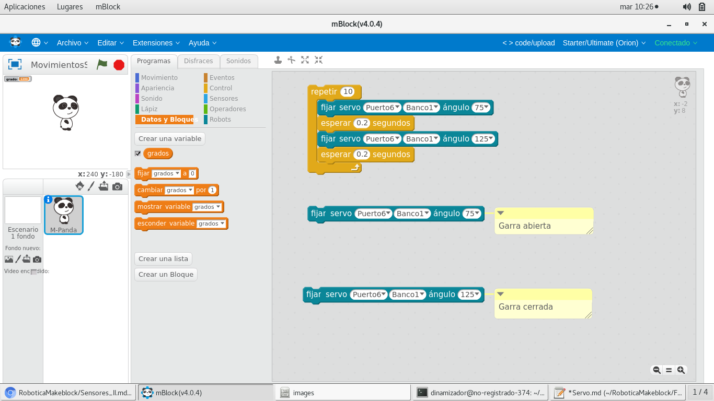

## Servomotor

Podemos conectar un servomotor

Cable Rojo --> Vcc
Cable Marrón o Negro ->> GND
Cable Naranja o Blanco ->> S

[Ejemplo](../Ejemplos/MovimientosServo.sb2)

[Calibración Garra](../Ejemplo/CalibracionGarra.sb2)

