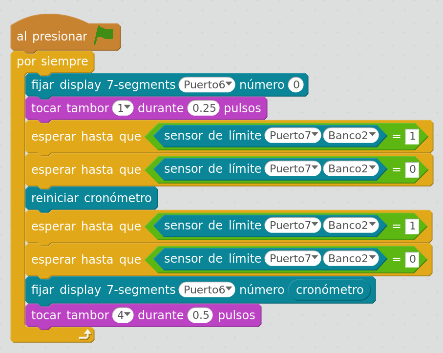

## Tiempo entre pulsaciones

Vamos a medir el tiempo entre pulsaciones en un microinterruptor

* La primera pulsación activar

[Codigo](../Ejemplos/TiempoEntrePulsaciones.sb2)

### Modificaciones

* Añade un segundo pulsador y haz que te

Ejemplos/Pulsaciones_en_10_segundos.sb2
Ejemplos/TiempoEntrePulsaciones.sb2
