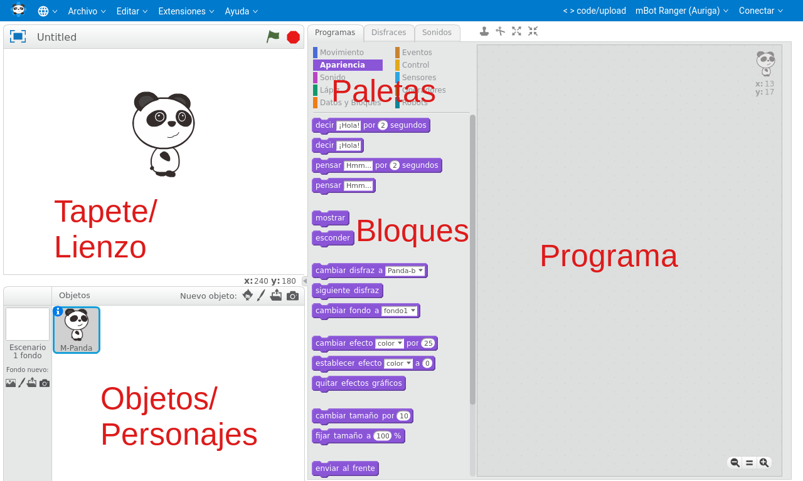

## mBlock

### Uso de mBlock

Las paletas nos permiten seleccionar grupos de bloques, donde se guardan por afinidad

Moveremos los bloques a la parte del programa para ir creando este

Los bloques se ejecutan siempre de arriba a abajo (y han de colgar de un evento)

Si pulsamos en un bloque lo ejecutamos aunque no forme parte del programa

Si se realizan movimientos del objeto o dibujos esto se harán sobre el lienzo

### Funcionamiento

Tenemos 2 modos de funcionamiento:

#### Scratch/mBlock

Podemos usar todos los bloques disponibles con lo que nuestro programa se ejecuta en el pc (actuando sobre los objetos) y en el robot (con todas las acciones que realizamos sobre este)

Nuestro acciones que enviamos al robot se interpretan sobre un [firmware base](./InstalacionFirmware.md) que tenemos que tener instalado en este

#### Modo Arduino

Dado que la placa base de nuestro robot está basada en Arduino, lo que hacemos es enviar un programa nativo a este, con lo que perdemos la posibilidad de ejecutar acciones sobre el PC. Muchos bloques no se pueden usar al activar el modo Arduino 

Vemos como muchas de las paletas se desactivan y aparece el código Arduino que genera nuestro programar. Si subimos el código al robot no podremos volver a usar el modo "Scratch" hasta que le instalemos el firmware

||Modo Scratch|Modo Arduino|
|---|---|---|
|Programación en el PC| SI|NO|
|Velocidad|Baja|Alta|
|Compatibilidad con Arduino|NO|100%|

### Extensiones

Mediante extensiones podemos ampliar la funcionalidad
