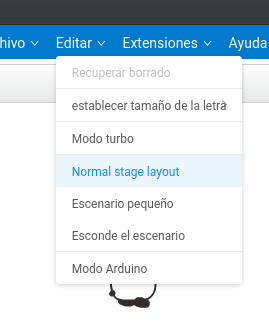

#### Modo Arduino

Dado que la placa base de nuestro robot está basada en Arduino, lo que hacemos es enviar un programa nativo a este, con lo que perdemos la posibilidad de ejecutar acciones sobre el PC. Muchos bloques no se pueden usar al activar el modo Arduino 

Vemos como muchas de las paletas se desactivan y aparece el código Arduino que genera nuestro programar. Si subimos el código al robot no podremos volver a usar el modo "Scratch" hasta que le instalemos el firmware

Cuando programamos en código Arduino es necesario usar unas librerías propias de Makeblock que podemos encontrar en su [github](https://github.com/Makeblock-official/Makeblock-Libraries)

||Modo Scratch|Modo Arduino|
|---|---|---|
|Programación en el PC| SI|NO|
|Velocidad|Baja|Alta|
|Compatibilidad con Arduino|NO|100%|

### Ejemplo: Velocidad del bucle

Convertir el siguiente código a Arduino

Podemos ver la diferencia entre la velocidad a la que se incrementa el contador...

### Ejemplo: reprogramar el ejemplo del siguelíneas usando código arduino

### Extensión Arduino-offline

