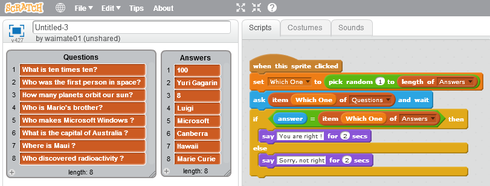

## Array en Scratch

Un Array no es más que una colección de variables que podemos usar juntas.

Se suelen utilizar para guardar grupos de valores.

Podemos acceder a sus valores como vemos en el siguiente programa

Un ejemplo típico es un programa de preguntas y respuestas

