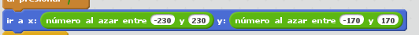
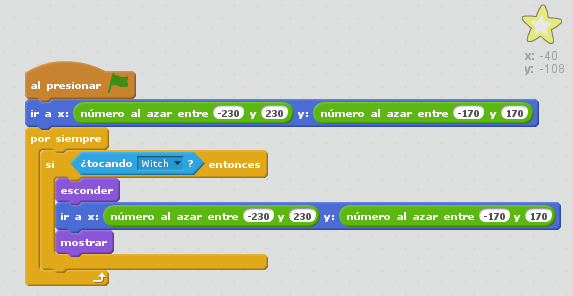

# Juegos

### Añadiendo azar

### Pueden interaccionar entre sí

### Los personajes hablan!!

### Ejercicio: Crea varios personajes y muévelos por pantalla

#### ¿ Cómo hacemos que haya varios personajes?

Ejemplos/BrujaYDragon.sb2

### Clones

Ejemplos/Nevada.sb2

Ejemplos/ControlTeclas3DColor.sb2
Ejemplos/ControlTeclas3D.sb2

[Tutoriales de dsigno](http://programamos.es/creando-un-videojuego-paso-a-paso-con-scratch-desde-cero/)

[libro virtual sobre scratch](http://www.tallertecno.com/libro.html#scratch)

[Tutorial básico sobre movimiento de personajes](http://programamos.es/creando-un-videojuego-paso-a-paso-con-scratch-desde-cero/)

## Referencias

[Diversos cursos](http://paunin.blogspot.com.es/2015/11/quieres-aprender-scratch.html)

[MOOC UOC](https://mooc.scratch.uoc.edu/courses/course-v1:UOCx+UOC002+015_T1/info)

[Aprendiendo Scratch desde 0](http://programamos.es/creando-un-videojuego-paso-a-paso-con-scratch-desde-cero/)

[Presentación Scratch](http://www.slideshare.net/josepujolperez/introduccion-a-scratch)

[Tutoriales](http://www.educaciontrespuntocero.com/recursos/el-proyecto-scratch-de-los-viernes-i-moviendo-el-gato/29934.html)

[Space Invaders](https://www.programoergosum.com/cursos-online/scratch/118-juego-de-space-invaders-programado-con-scratch/introduccion)
