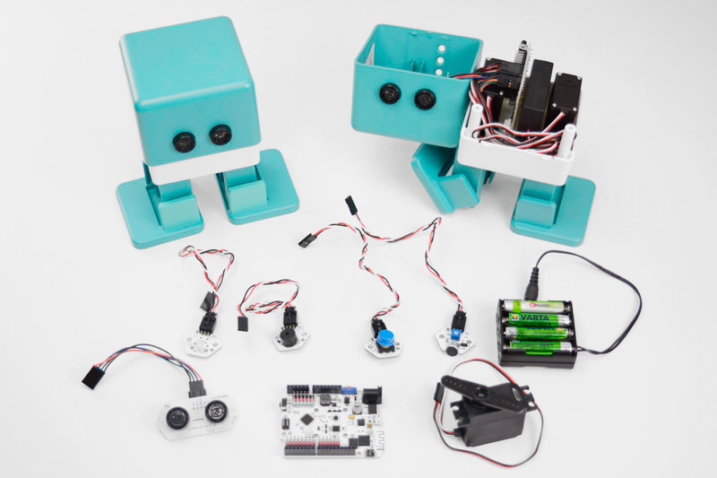
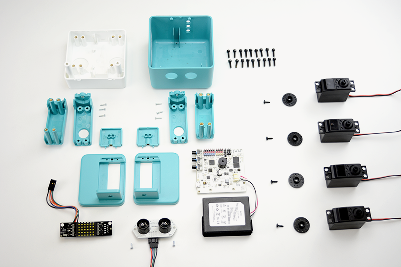
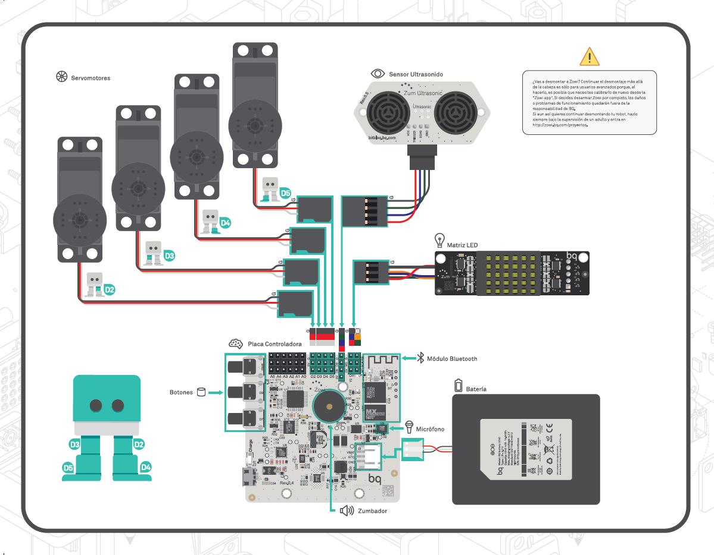

# Curso Superior de Innovación Pedagógica y Metodologías para el Aprendizaje.

## Módulo de Programación y Robótica.

### José Antonio Vacas @javacasm

# ¿Qué es un robot?

¿[encuesta](https://create.kahoot.it/?_ga=1.256153608.2056625729.1452556026&deviceId=365ec0cb-25a2-47f5-8862-2a26ec6fe460#survey/bc3cc91c-6a19-4b4b-8dd4-621a4950a337)?

"Máquina automática programable capaz de realizar determinadas operaciones de manera autónoma y sustituir a los seres humanos en algunas tareas, en especial las pesadas, repetitivas o peligrosas; puede estar dotada de sensores, que le permiten adaptarse a nuevas situaciones”

### ¿Qué hay dentro de Zowi?

* Placa controladora
* Batería
* Servomotores
* Sensor ultrasonidos
* Micrófono
* Zumbador
* Botones

* ¡¡ Y un programa !!

## Zowi ...
* Es open-source](https://github.com/bqlabs/zowi)
* Se puede [reprogramar](http://bitbloq.bq.com)
* Puedes cambiar su aspecto y Diseñar complementos
  

* Añadirle nuevos movimientos

[vídeo](https://twitter.com/BQAcademyES/status/695296147464806400)

* Algunos [ejemplos](https://github.com/bqlabs/zowi/tree/master/mods) de cambios

  

## Otros Robot sencillos
* Para infantil: [Bichobot](./bichobot.md)
* Para primaria: [Escornabot](./escornabot.md)

### Fases para construir  un robot

Son 4 las fases para construir un Robot

1. Mecánica: diseño de la estructura
  * Plantilla
  * Diseño
  * ¡¡ Improvisación !!
  * Materiales
  * Reciclado
2. Eléctrica: motores, alimentación,...
  * Pilas, baterías
  * Motores
3. Electrónica: necesitamos un control fino de los elementos
  * CPU (usamos un tipo especial llamado microncontroladores - Arduino)
  * Interruptores
  * Sensores
4. Informatica: crearemos un programa capaz de controlar los elementos y hacer cumplir al robot las funciones que necesitamos	
